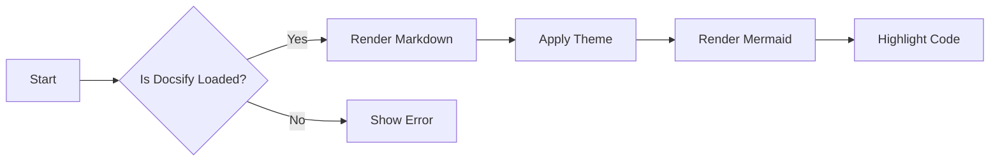
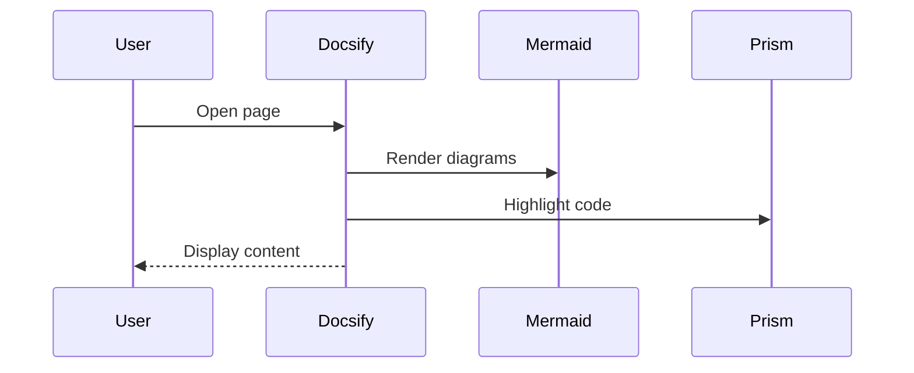
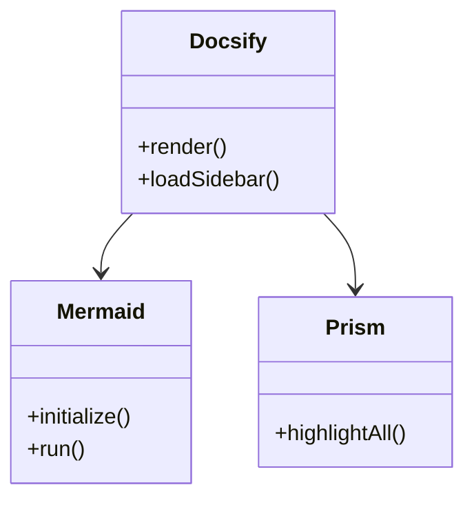

# Docsify Rendering Test

- [Inline Code Test](#inline-code-test)
- [JavaScript Code Block (Prism)](#javascript-code-block-prism)
- [Python Code Block (Prism)](#python-code-block-prism)
- [JSON Code Block (Prism)](#json-code-block-prism)
- [Mermaid Flowchart](#mermaid-flowchart)
- [Mermaid Sequence Diagram](#mermaid-sequence-diagram)
- [Mixed Content Stress Test](#mixed-content-stress-test)
- [Long Code Block (Scrolling)](#long-code-block-scrolling)
- [Table Rendering](#table-rendering)
- [Mermaid Class Diagram](#mermaid-class-diagram)
- [End](#end)


This file tests **Prism syntax highlighting** and **Mermaid diagram rendering**.

---

## Inline Code Test

Inline example:

`const answer = 42;`

---

## JavaScript Code Block (Prism)

```js
function greet(name) {
  if (!name) {
    throw new Error("Missing name");
  }

  return `Hello ${name}`;
}

console.log(greet("Docsify"));
```

---

## Python Code Block (Prism)

```python
def fibonacci(n):
    a, b = 0, 1
    sequence = []

    while len(sequence) < n:
        sequence.append(a)
        a, b = b, a + b

    return sequence

print(fibonacci(10))
```

---

## JSON Code Block (Prism)

```json
{
  "name": "Docsify Test",
  "version": "1.0.0",
  "features": [
    "prism",
    "mermaid",
    "theme-toggle"
  ],
  "enabled": true
}
```

---

## Mermaid Flowchart



---

## Mermaid Sequence Diagram



---

## Mixed Content Stress Test

Paragraph before code:

```bash
npm install docsify mermaid prismjs
```

Paragraph after code.

---

## Long Code Block (Scrolling)

```js
const data = Array.from({ length: 20 }, (_, i) => ({
  id: i + 1,
  name: `Item ${i + 1}`,
  active: i % 2 === 0
}));

const activeItems = data.filter(item => item.active);

console.table(activeItems);
```

---

## Table Rendering

| Feature | Status |
| ------- | ------ |
| Mermaid | OK     |
| Prism   | OK     |
| Dark UI | OK     |
| Toggle  | OK     |

---

## Mermaid Class Diagram



---

## End

If everything above renders correctly:

* Mermaid diagrams appear (not raw text)
* Code is highlighted
* Dark mode recolors Mermaid + Prism
* Toggle animation is smooth

Then your setup is working correctly.
